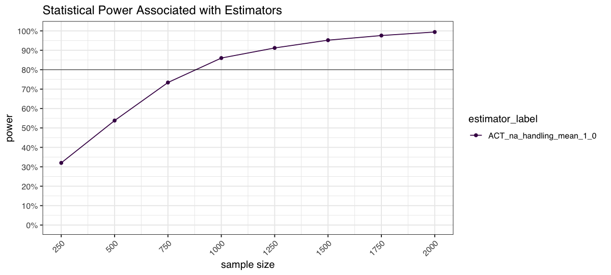

# Design Diagnosis Assignment (Week 4 assignment)
**COMM4940**

Cornell University Department of Communication

J. Nathan Matias([@natematias](https://twitter.com/natematias))

## Deadline
This assignment is due by 9pm on Tuesday, March 3rd and will be submitted/graded in pairs.

## Assignment
For this assignment in pairs, create a report for the Great Backyard Bird Count that describes the minimum effect size they are likely to see with a given sample size. If your team was previously assigned to develop an idea for eBird or FeederWatch, you should stick with the same project as before.

The final assignment will be a 4-5 paragraph essay that:
* Explains the study design in your own words:
  * Newcomers to the GBBC will be enrolled in one of two different studies (one for FeederWatch, one for GBBC). 
  * Within each study of the newcomers will be assigned to the previous year's email [see the example here](https://github.com/natematias/design-governance-experiments/blob/master/assignments/2-email-pitch/GBBC-example-email-2019.png)
  * The other half will be assigned to the new messaging
  * 4 weeks after receiving the message, we will count:
    * Whether they clicked to open the email
    * Whether they took a further action:
      * (eBird) contributed at least one more list
      * (FeederWatch) signed up for the program
  * We will then conduct a statistical test of the effect of the intervention on the chance that they took a further action
* Explains how sample size and effect size are related
* Since we have a fixed sample size, explain the smallest effect we would have an 80% chance of observing, for the sample available for the study
* Offer your prediction of the chance of observing a statistically-significant effect, based on what you know about the messaging we plan to use (see slides for Feb 26). Do you think it's likely that the true effect is as large as the minimum observable effect?

## Conducting the Analysis
To conduct the analysis, you can use the code in [Starting Point - Binary Outcome.ipynb](Starting Point - Binary Outcome.ipynb). If you feel able, you can adjust the code to keep the sample size fixed and adjust the effect size. Or you can just run the code repeatedly until you find a close enough effect size.

## Essential Information
In 2019, roughly 18,670 people joined the Great Backyard Bird Count for the first time. If 2020 is similar, the sample size for each experiment will be 9,000. The treatment and control groups for eBird will each include 4,500 participants The treatment and control groups for FeederWatch will also include 4,500 participants each.

In 2019, 80 GBBC newcomers signed up for FeederWatch (four tenths of one percent, 0.4%). That year for eBird, 1.3% contributed over twelve checklists in the following year. Since we're only observing a month, and we're only observing whether people contribute just one checklist, let's assume for the assignment that the base rate for the control group will be 1.3%.
